## build-t00ls Nikitsenka

### Install Maven on VM, implement pom.xml, build and execute.
Also for using Java-12 add to pom.xml:
<properties>
        <maven.compiler.source>1.6</maven.compiler.source>
        <maven.compiler.target>1.6</maven.compiler.target>
</properties>
Result:
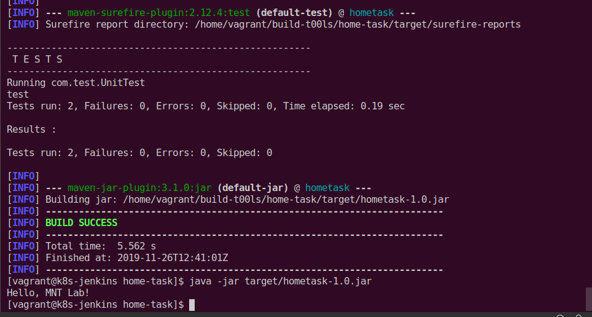

### Install Maven on Jenkins, build, execute, archive and test.
Install Maven plugin to Jenkins:
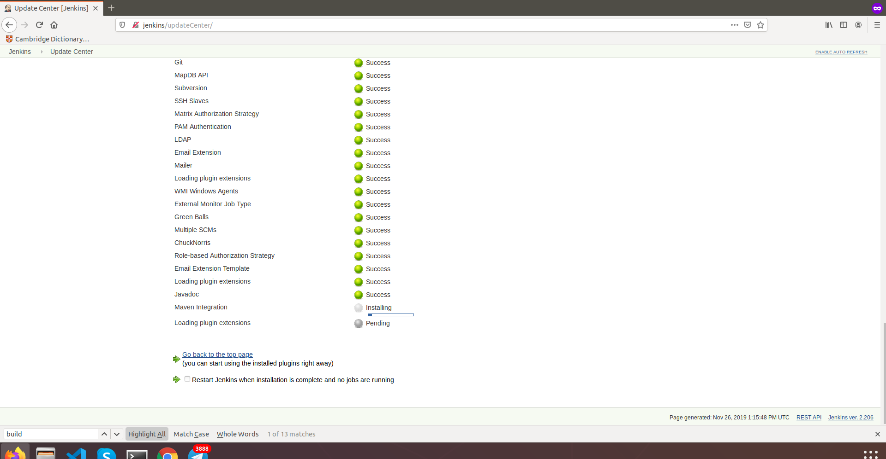

Add Maven installation to "Global Tool Configuration":
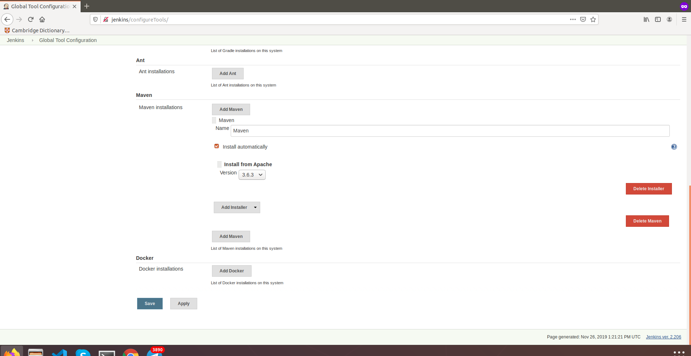

Create Maven project item (job) with appropriate name:
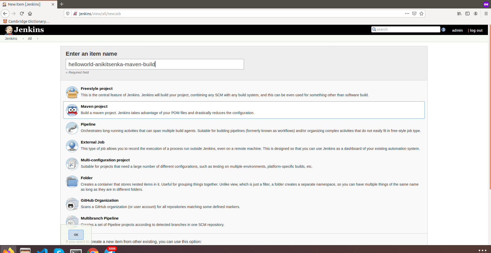

Add repo with specified branch to job:
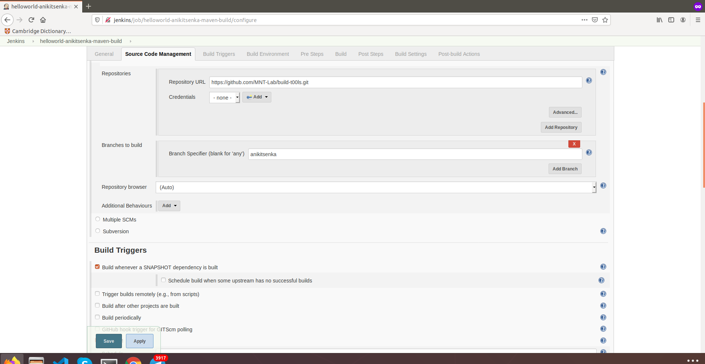

Set trigger build:
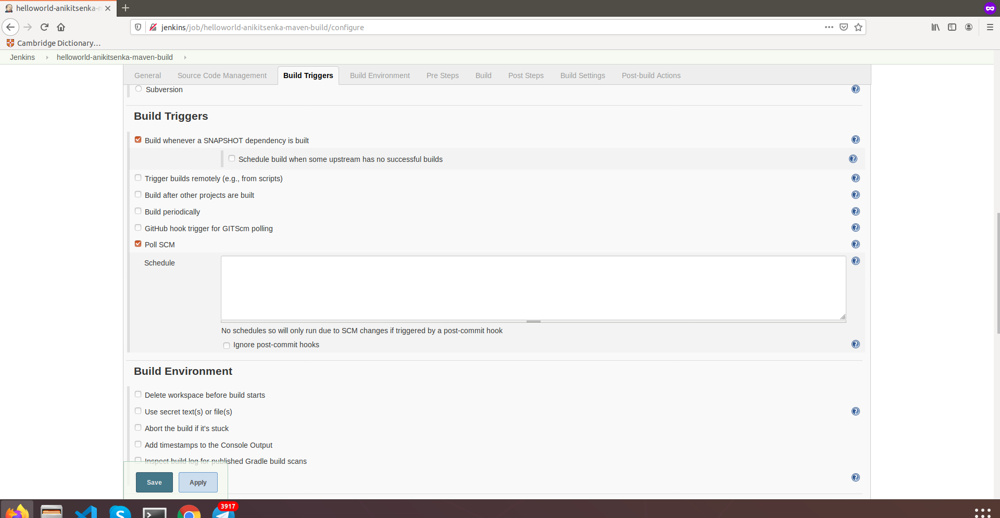

Set build and post-build steps:
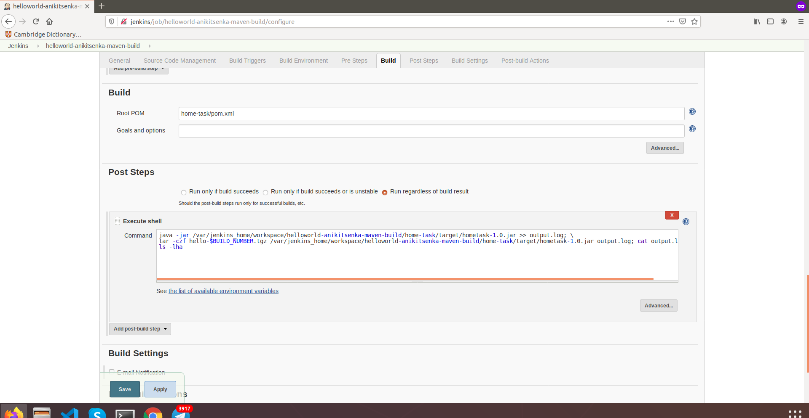

Console output of Maven job:
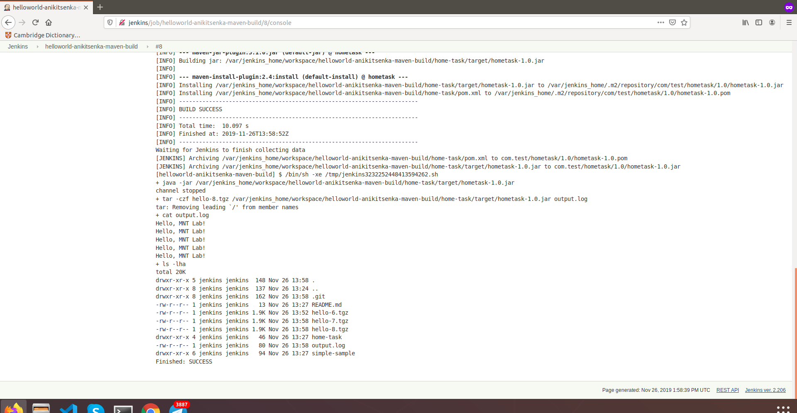

Workspace of Maven job on master:
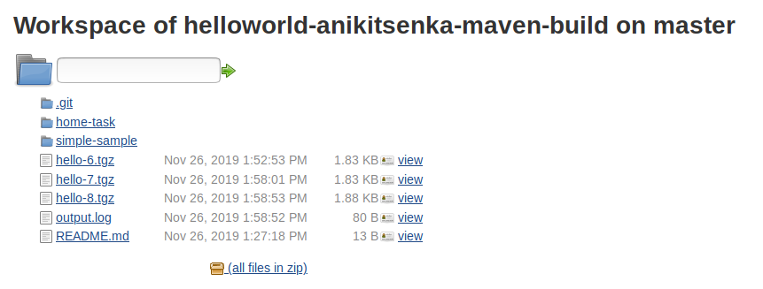

### Install Gradle on VM, implement gradle.build, build and execute.
Result:
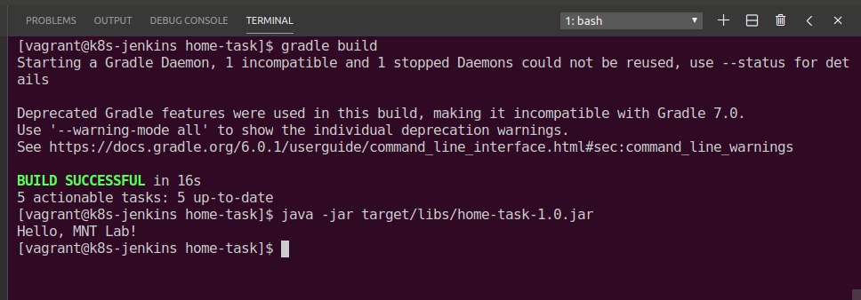

### Install Gradle on Jenkins, build, execute, archive and test.
Add Gradle installation to "Global Tool Configuration":
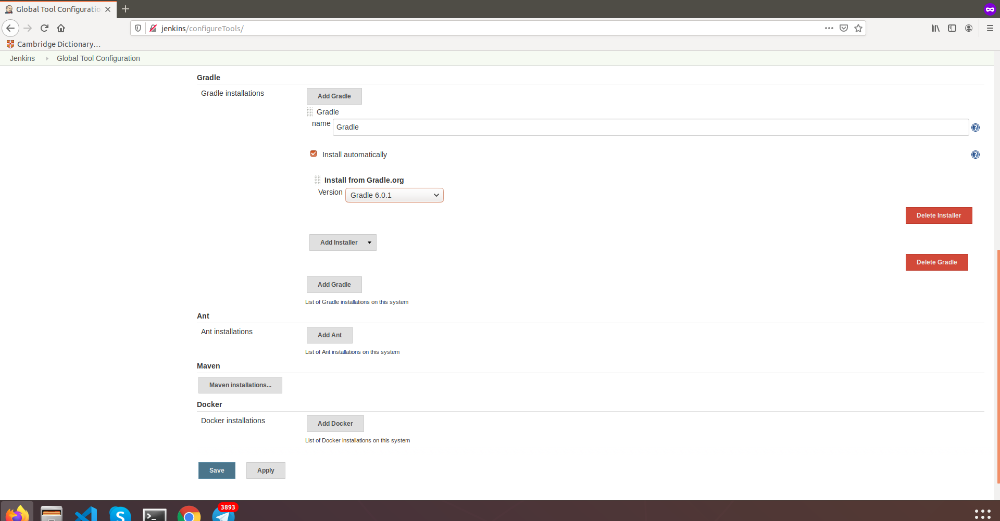

Create freestyle project item (job) with appropriate name for Gradle build:
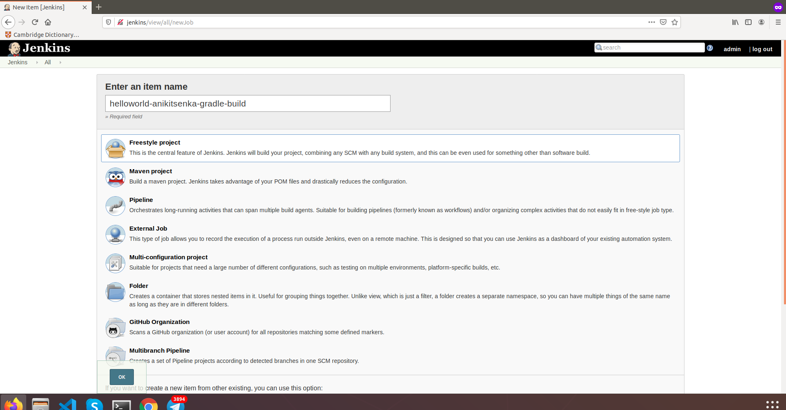

Add repo with specified branch to job:
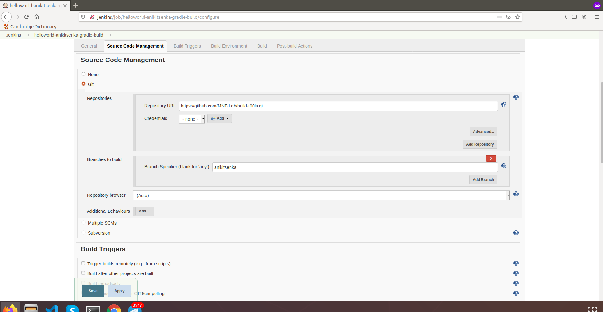

Set trigger build:
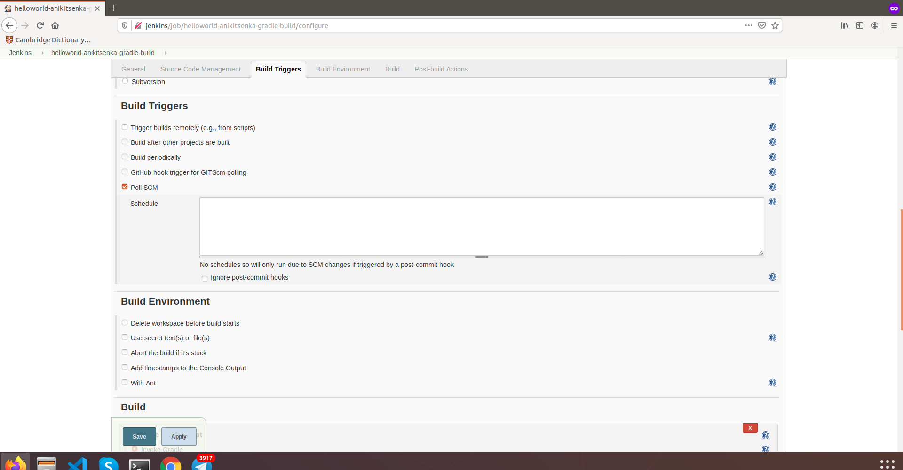

Set build step:
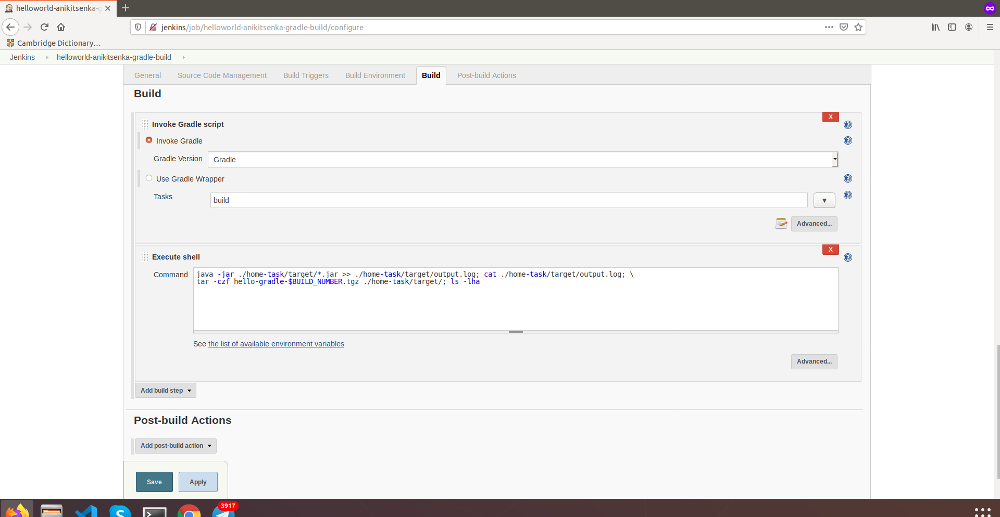

Set post-build step: 
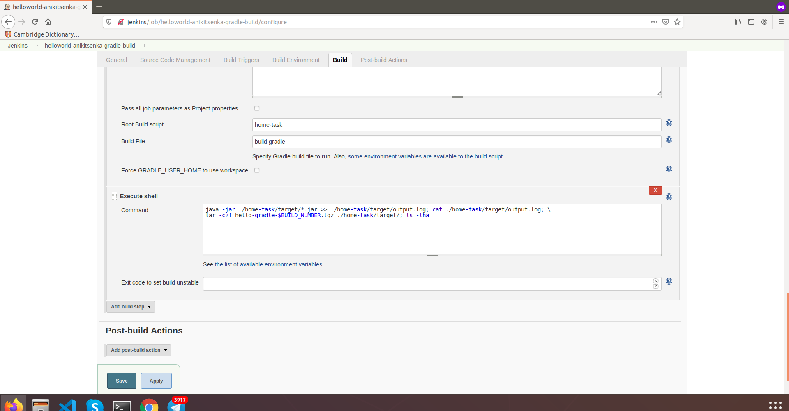

Console output of Gradle job:
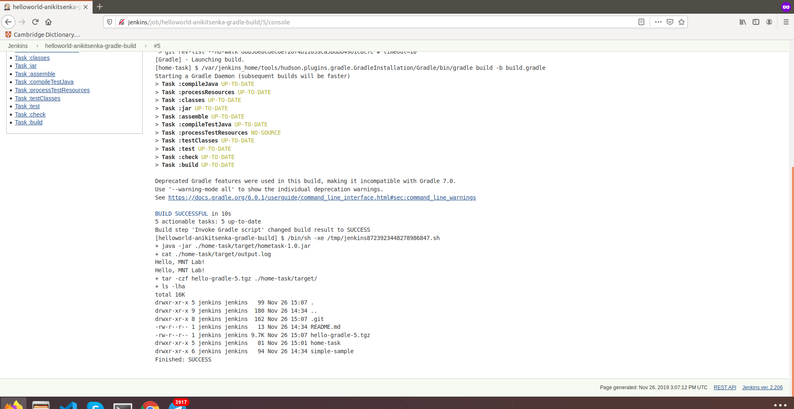

Workspace of Gradle job on master:
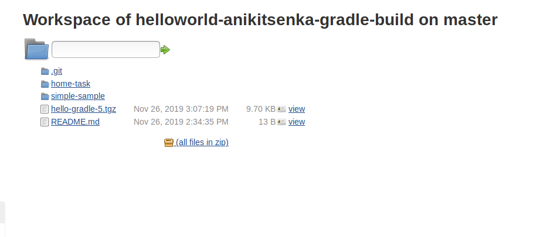

