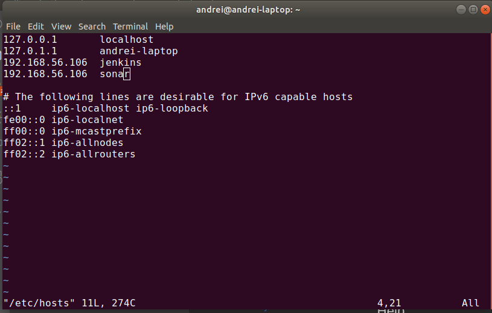
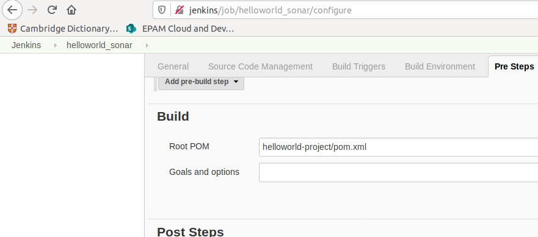

## Automated code analsis Nikitsenka

### Develop deployments for PostgreSQL, persistent volume, Sonarqube.
You can find this files there:
https://github.com/MNT-Lab/jenkins-install/tree/anikitsenka/day6_sonar

For deploying:
- kubectl create secret generic postgres-pwd --from-literal=password=<YOUR_PASSPHRASE>
- kubectl apply -f *.yml

Also added rule for ingress:

And add string to /etc/hosts/

Install Sonar plugin to Jenkins:

Sonar is installed, it's time to setup Jenkins for connection:

On these screenshots both types of connections to Sonar: NodePort and ClusterIP via Ingress.
Because I added ingress rule and changed connection type at the ending of the task.

### Configure Sonar and Jenkins.
Change user settings in Sonar:

Enable force user authentication:

Create token for user, that will be share with Jenkins.

Jenkins - Global Tool Configuration - SonarQube Scanner

Jenkins - Configuration - SonarQube servers

Add credentials for connection (token from previous step):

### Create some job with SonarQube.
Install Java Plugin to Sonar:

Restart Sonar to apply Java Plugin:

Create job with pulling from GIT branch:

Set build settings:

Set Execute SonarQube Scanner parameters:

### Execute some job with SonarQube.
Console output: 

SonarQube report:

### Add infinity loop to the src and execute job.
Making changes into src:

Console output:

Job in Jenkins:

Quality profile:

A diagram which describes the interaction between the items in Kubernetes
(pods: Jenkins, sonar; their services, ingresses, etc) :

