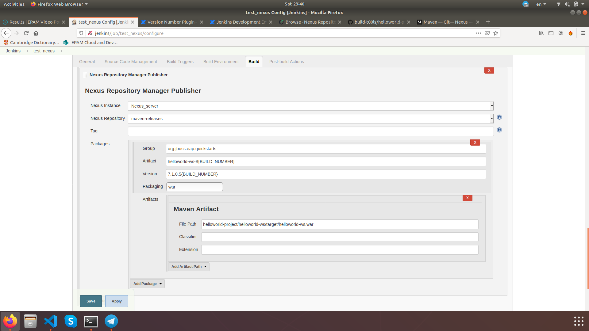
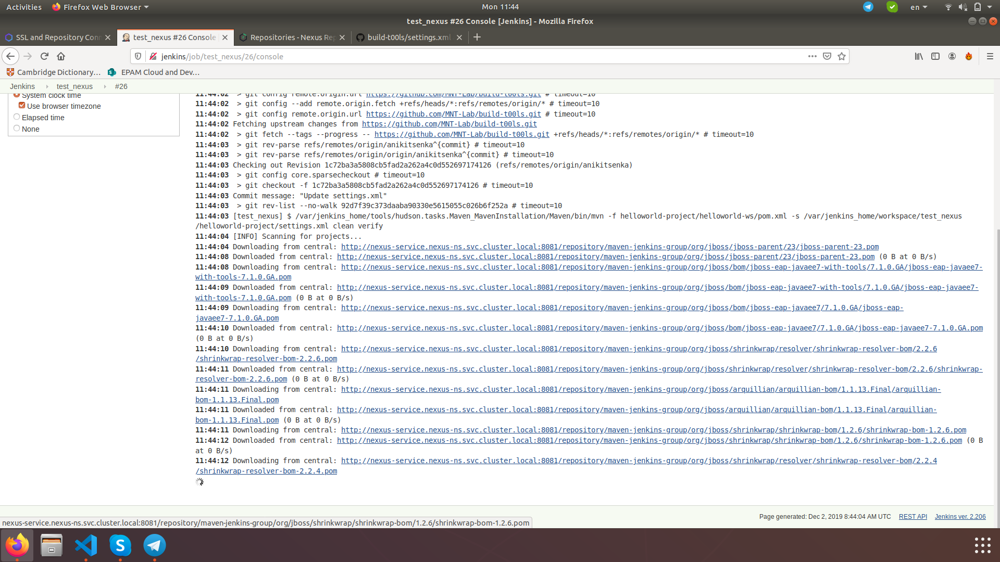
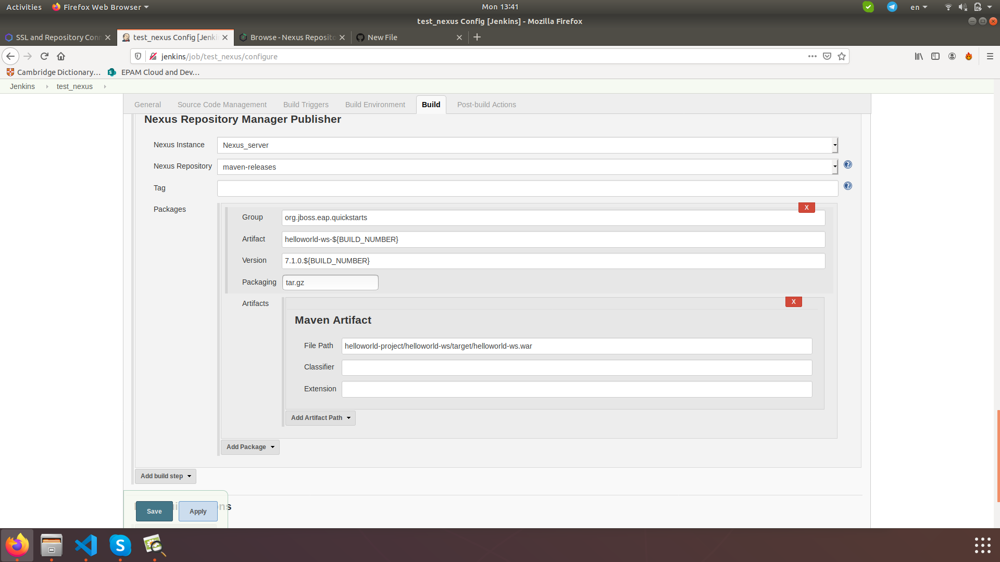

## Storing artefacts and managing proxy with NEXUS

### Develop deployment for Nexus, persistent volume.
You can find this files there:

File setting.xml you can find here:
https://github.com/MNT-Lab/build-t00ls/blob/anikitsenka/helloworld-project/settings.xml

For deploying:
- kubectl apply -f *.yml

Deploy Nexus, disable anonymous access:

Installation complete:

Install Nexus Platform plugin to Jenkins:

It's time to setup Jenkins for connection:

On these screenshots both types of connections to Nexus: NodePort and ClusterIP via Ingress.
Because I added ingress rule and changed connection type at the ending of the task.

### Configure Nexus with Jenkins.
Successful storing artefacts in Nexus:

Also with build number:

Configuration of Jenkins job for it.

Add repo for storing into Jenkins. 

List of repos.

Add repo (type = group) for proxy:

### Using Nexus like proxy repo in Jenkins Job.
Downloading via Nexus proxy:

Storing dependencies in Nexus repo:

Configuration of Jenkins job (Build) for it:

Configuration of Jenkins job (Nexus Repository Manager Publisher):

Files in Nexus repo:

