## Automated deployment. Public Java-based project will be setup in
## Jenkins job for automated deployments into Dockerized Environment.

You can find deployment and docker files there:
https://github.com/MNT-Lab/build-t00ls/tree/anikitsenka/helloworld-project/task_day8/

## Settings

### 1. Job "anikitsenka-docker-build"
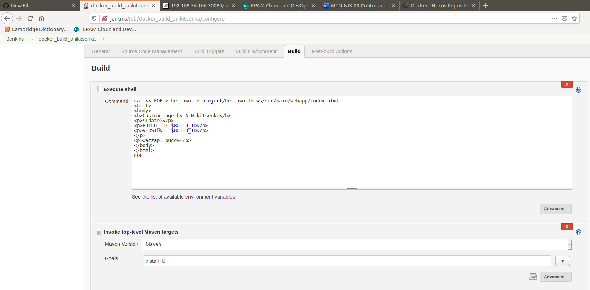
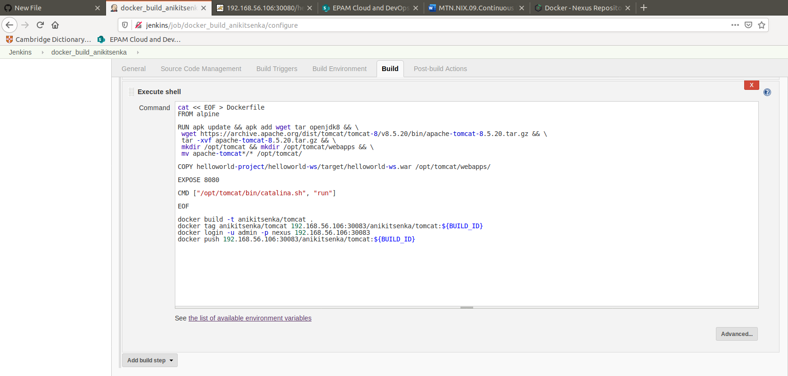
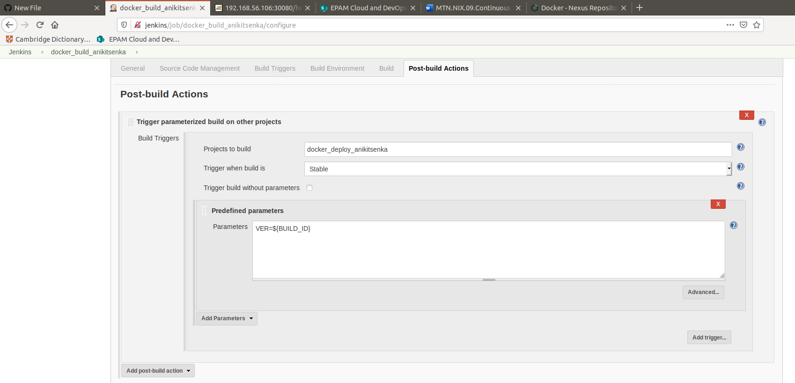
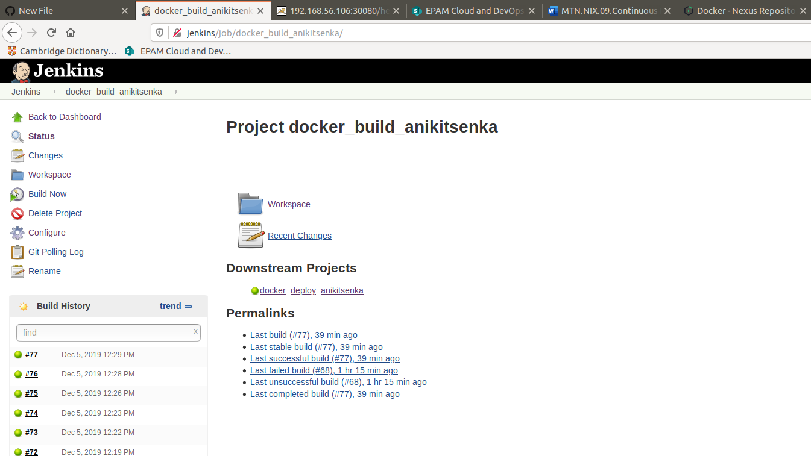

### 2. Job "anikitsenka-docker-deploy"
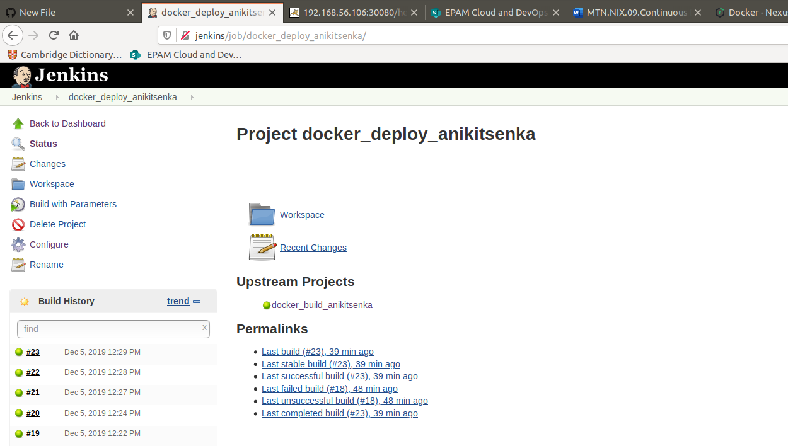
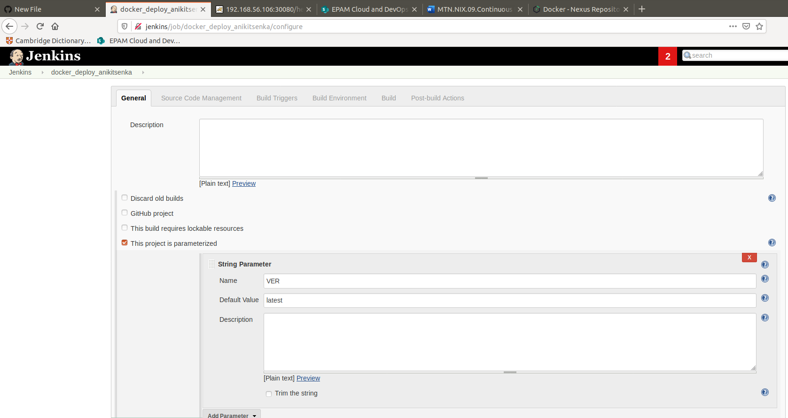
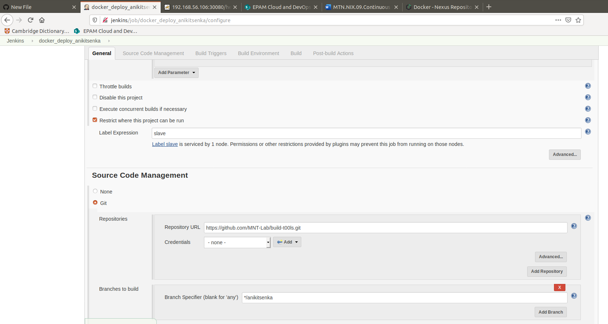
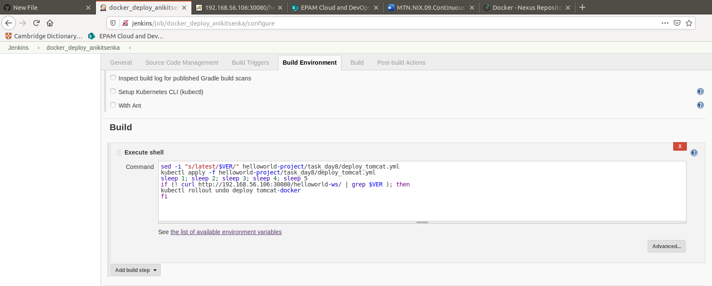

## Checks

### 1. Job is scheduled and executed automatically
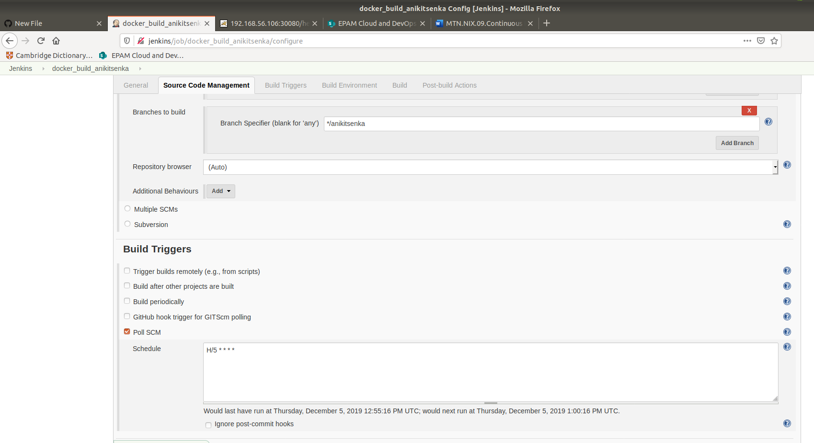
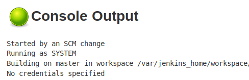

### 2. All created artifacts are stored in repository (archived war file (optional), docker image)
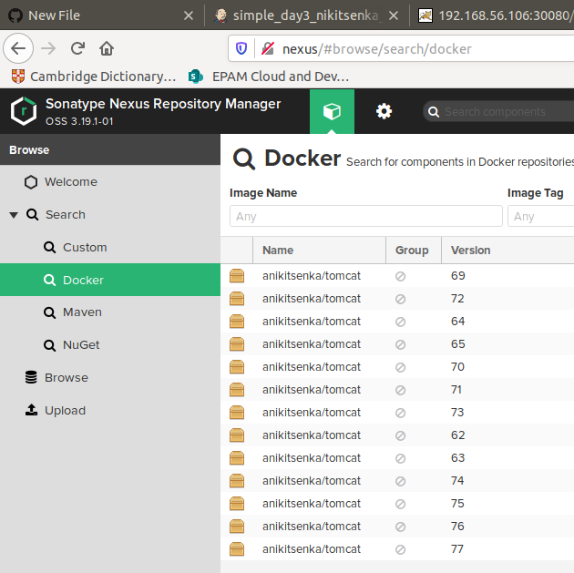

### 3. Project is redeployed to Kubernetes.
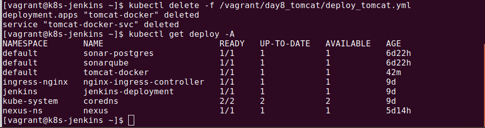

### 4. Project is accessible via HTTP after deployment. Shows application page with metadata.
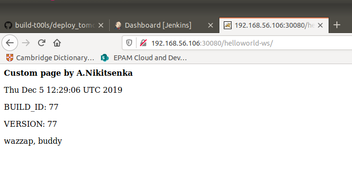

### Diagram which describes versioning semantic in this CD process.
### Diagram should contain full picture from commit to running application. 

